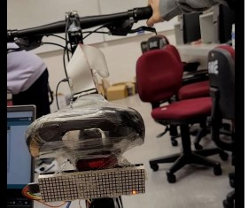

# Development of A Smart Bicycle
*My Final Year Project*

The Interdepartmental Final Year Project is a collaborative capstone project completed by students from departments of the Faculty of Engineering at Hong Kong Polytechnic University. The project typically includes several faculty areas such as Electrical Engineering and Computing, where students contribute to the project with their own areas of expertise. I had the honor to participate in the *Development of A Smart Bicycle* led by ISE and won the Creative Project Award. 

*Development of A Smart Bicycle* aims to develop a smart bicycle to improve people's riding experience by applying the cutting-edge technologies. The smart bicycle can enhance user experience by providing posture suggestion and tail light automation for traffic safety. Our smart bicycles are targeted at citizens, so the ideal outcome is that users can review their trip with a smartphone app where all suggestions, records, etc. are saved instead of the bicycle. In the project, I am responsible for developing the prototype of Cycling Patten Recognition with motion sensors and Machine Learning. Through this project, I have enhanced my interpersonal skills and technical skills in data analytics and the application of ML models in real life. Finally, a branch of Cycling Pattern Recognition: Turning Tendency Prediction model (which predicts future turning tendency) is developed and implemented on bicycles. 

This repo concludes my method of doing so and it may help others to do research.

## Notes
- All Python files are compatible with Python 2.7
- All Python files are compatible with Python 3.7 except Raspberry-Pi/taillightControl.py because of coding. Therefore, The whole system needs to be ran in Python 2.7
- Raspberry-Pi/requirements.txt is only a recommended installation list.
- You may need to change the file paths in trainingOfXXXXXX.py to generate ML models

## Raspberry Pi
Cycling Pattern Recognition and Turning Tendency Prediction rely on Machine Learning models and have to be fast to process a variety of data. Therefore, a Raspberry Pi 4B is used to organize sensors and load trained models. It reads data from sensors and send it to the real-time processing pipeline. After the pipeline returns the result, it sends a signal to the Arduino connected with the LED tail light. The system starts with a command `python Raspberry-Pi/main.py` and terminates with `CTRL`+`C` in CMD in Raspberry Pi.

## Real-time processing pipeline
The real-time processing pipeline begins when it receives a set of data from IMU sensor and pedal force sensors. After that, it merges and transforms them into a desired format and then passes it into the loaded models immediately. The models do predictions, return the result and wait for the next set of data. The predicted results and processed data are saved into a data frame. A CSV file containing recorded data will be saved with current date if any exception happens.

## IMU sensor (Inertial Measurement Unit sensor)
ROS IMU HFI A9 sensor is used to collect power indicators such as acceleration and Euler angles. METAMOTION (Wireless sensor) is not selected at the end because the API is not up-to-date and it is easier to build the prototype with wired sensor. The Python code to read IMU data is given by TA, which saves the time for coding the sensor. 

## LED tail light and Arduino
LED tail light is an important feature in my part of the project. Turning Tendency Prediction uses a model with 97% accuracy to predict turning tendency. However, the predicted results are 0, 1 and 2 representing straight in, left and right. To make it easier for pedestrians and other riders to understand, the results are converted to left and right arrows and displayed with a LED tail light. Since the given tail light does not have a USB port, an Arduino UNO board is used to listen from Raspberry Pi and control the LED tail light




## System design
#### Architecture

#### Flow-chart


## File structure

**Essential files**
- Raspberry-Pi/main.py: Main function of the system
- Raspberry-Pi/taillightControl.py: Control the LED tail light
- Raspberry-Pi/ArdUnoConnection.py: Communicate with Arduino UNO
- .SAV files: Trained models for Turning Tendency Prediction.
- Raspberry-Pi/dev_hardware_SPI.so: Connect the LED tail light in Raspberry-Pi/taillightControl.py

**Supporting files**
- Raspberry-Pi/MAX7219.py: Test the LED tail light
- Raspberry-Pi/RealModelTesting.py: Test the trained models
- Raspberry-Pi/requirements.txt: Suggested packages to install
- Raspberry-Pi/trainingOfXXXXXX.py: Train models for Turning Tendency Prediction

- IMU/data/: .CSV files for training
- IMU/hfi_a9_exportXXXXX.py: Test the IMU sensor and record data in Windows and Linux.

## To run the whole system
```bash
python Raspberry-Pi/main.py
```


